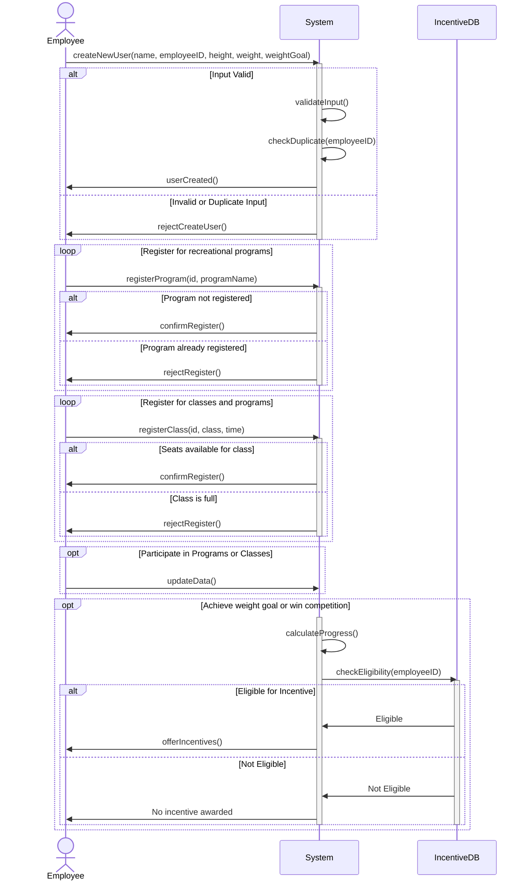

```mermaid
sequenceDiagram
    actor Employee
    participant System
    participant IncentiveDB

    Employee->>System: createNewUser(name, employeeID, height, weight, weightGoal)
    activate System
    alt Input Valid
        System->>System: validateInput()
        System->>System: checkDuplicate(employeeID)
        System->>Employee: userCreated()
    else Invalid or Duplicate Input
        System->>Employee: rejectCreateUser()
    end
    deactivate System

    loop Register for recreational programs
        Employee->>System: registerProgram(id, programName)
        activate System
        alt Program not registered
            System->>Employee: confirmRegister()
        else Program already registered
            System->>Employee: rejectRegister()
        end
        deactivate System
    end

    loop Register for classes and programs
        Employee->>System: registerClass(id, class, time)
        activate System
        alt Seats available for class
            System->>Employee: confirmRegister()
        else Class is full
            System->>Employee: rejectRegister()
        end
        deactivate System
    end

    opt Participate in Programs or Classes
        Employee->>System: updateData()
    end

    opt Achieve weight goal or win competition
        activate System
        System->>System: calculateProgress()
        System->>IncentiveDB: checkEligibility(employeeID)
        activate IncentiveDB
        alt Eligible for Incentive
            IncentiveDB->>System: Eligible
            System->>Employee: offerIncentives()
        else Not Eligible
            IncentiveDB->>System: Not Eligible
            System->>Employee: No incentive awarded
        end
        deactivate IncentiveDB
        deactivate System
    end
```