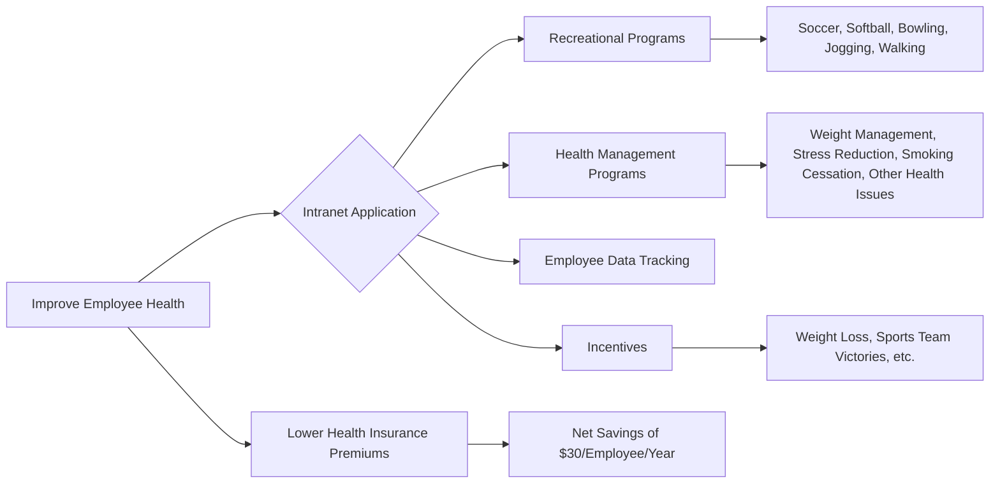

```mermaid
graph LR
    A[Improve Employee Health] --> B{Intranet Application}
    B --> C[Recreational Programs]
    C --> D[Soccer, Softball, Bowling, Jogging, Walking]
    B --> E[Health Management Programs]
    E --> F[Weight Management, Stress Reduction, Smoking Cessation, Other Health Issues]
    B --> G[Employee Data Tracking]
    B --> H[Incentives]
    H --> I[Weight Loss, Sports Team Victories, etc.]
    A --> J[Lower Health Insurance Premiums]
    J --> K[Net Savings of $30/Employee/Year]
```