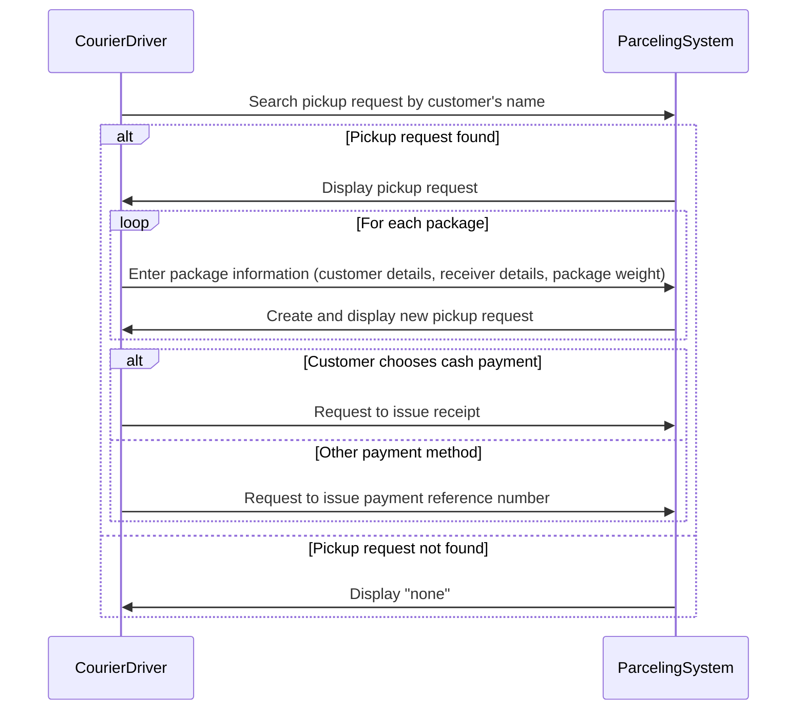

```mermaid
sequenceDiagram
    participant CourierDriver
    participant ParcelingSystem

    CourierDriver->>ParcelingSystem: Search pickup request by customer's name
    alt Pickup request found
        ParcelingSystem->>CourierDriver: Display pickup request

        loop For each package
            CourierDriver->>ParcelingSystem: Enter package information (customer details, receiver details, package weight)
            ParcelingSystem->>CourierDriver: Create and display new pickup request
        end

        alt Customer chooses cash payment
            CourierDriver->>ParcelingSystem: Request to issue receipt
        else Other payment method
            CourierDriver->>ParcelingSystem: Request to issue payment reference number
        end
    else Pickup request not found
        ParcelingSystem->>CourierDriver: Display "none"
    end

```