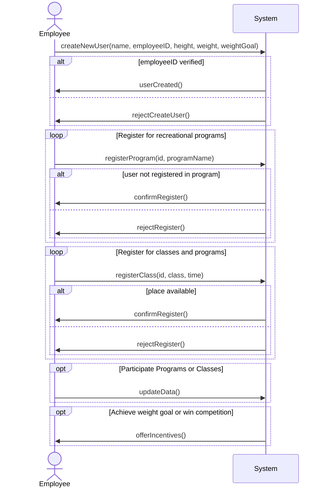

```mermaid
sequenceDiagram
    actor Employee
    participant System

    Employee->>System: createNewUser(name, employeeID, height, weight, weightGoal)
    alt employeeID verified
        System->>Employee: userCreated()
    else
        System->>Employee: rejectCreateUser()
    end

    loop Register for recreational programs
        Employee->>System: registerProgram(id, programName)
        alt user not registered in program
            System->>Employee: confirmRegister()
        else
            System->>Employee: rejectRegister()
        end
    end

    loop Register for classes and programs
        Employee->>System: registerClass(id, class, time)
        alt place available
            System->>Employee: confirmRegister()
        else
            System->>Employee: rejectRegister()
        end
    end

    opt Participate Programs or Classes
        Employee->>System: updateData()
    end

    opt Achieve weight goal or win competition
        System->>Employee: offerIncentives()
    end
```