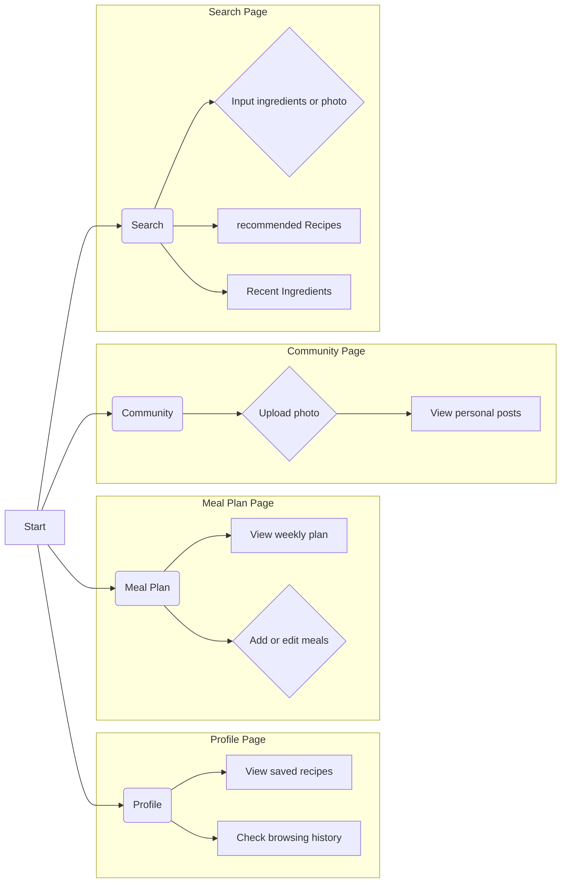

```mermaid
graph LR
    A[Start] --> B(Search);
    A --> C(Community);
    A --> D(Meal Plan);
    A --> E(Profile);

    
    subgraph "Profile Page"
        E --> L[View saved recipes];
        E --> M[Check browsing history];
        
    end
      subgraph "Meal Plan Page"
        D --> J[View weekly plan];
        D --> K{Add or edit meals};
    end
     subgraph "Community Page"
        C --> H{Upload photo};
        H --> I[View personal posts];
    end
    subgraph "Search Page"
        B --> F{Input ingredients or photo};
        B --> G[recommended Recipes];
        B --> N[Recent Ingredients];
    end
```