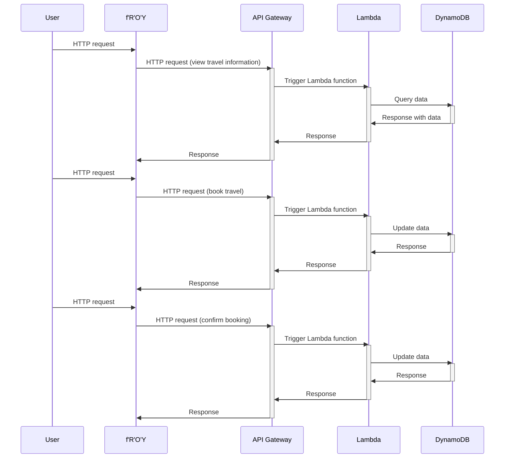

```mermaid
sequenceDiagram
    participant User
    participant f'R'O'Y
    participant API Gateway
    participant Lambda
    participant DynamoDB

    User->>f'R'O'Y: HTTP request
    f'R'O'Y->>API Gateway: HTTP request (view travel information)
    activate API Gateway
    API Gateway->>Lambda: Trigger Lambda function
    activate Lambda
    Lambda->>DynamoDB: Query data
    activate DynamoDB
    DynamoDB->>Lambda: Response with data
    deactivate DynamoDB
    Lambda->>API Gateway: Response
    deactivate Lambda
    API Gateway->>f'R'O'Y: Response
    deactivate API Gateway

    User->>f'R'O'Y: HTTP request
    f'R'O'Y->>API Gateway: HTTP request (book travel)
    activate API Gateway
    API Gateway->>Lambda: Trigger Lambda function
    activate Lambda
    Lambda->>DynamoDB: Update data
    activate DynamoDB
    DynamoDB->>Lambda: Response
    deactivate DynamoDB
    Lambda->>API Gateway: Response
    deactivate Lambda
    API Gateway->>f'R'O'Y: Response
    deactivate API Gateway

    User->>f'R'O'Y: HTTP request
    f'R'O'Y->>API Gateway: HTTP request (confirm booking)
    activate API Gateway
    API Gateway->>Lambda: Trigger Lambda function
    activate Lambda
    Lambda->>DynamoDB: Update data
    activate DynamoDB
    DynamoDB->>Lambda: Response
    deactivate DynamoDB
    Lambda->>API Gateway: Response
    deactivate Lambda
    API Gateway->>f'R'O'Y: Response
    deactivate API Gateway
```