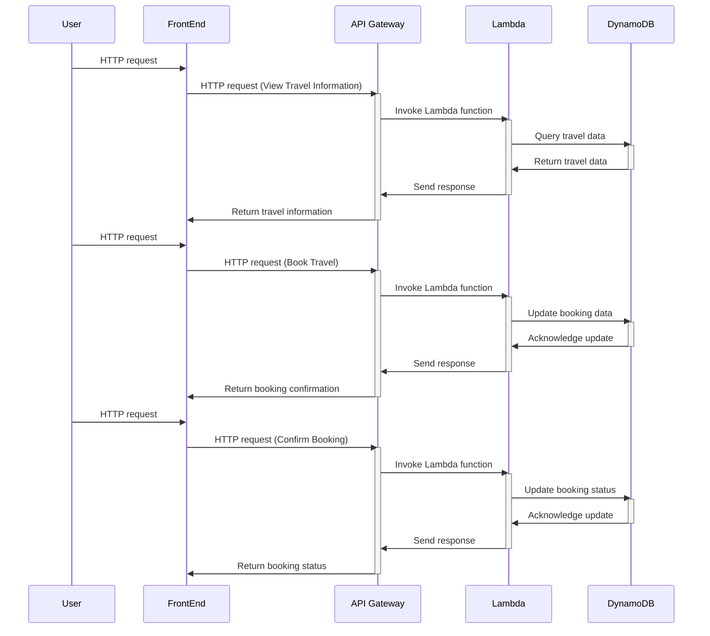

```mermaid
sequenceDiagram
    participant User
    participant FrontEnd
    participant API Gateway
    participant Lambda
    participant DynamoDB

    User->>FrontEnd: HTTP request
    FrontEnd->>API Gateway: HTTP request (View Travel Information)
    activate API Gateway
    API Gateway->>Lambda: Invoke Lambda function
    activate Lambda
    Lambda->>DynamoDB: Query travel data
    activate DynamoDB
    DynamoDB->>Lambda: Return travel data
    deactivate DynamoDB
    Lambda->>API Gateway: Send response
    deactivate Lambda
    API Gateway->>FrontEnd: Return travel information
    deactivate API Gateway

    User->>FrontEnd: HTTP request
    FrontEnd->>API Gateway: HTTP request (Book Travel)
    activate API Gateway
    API Gateway->>Lambda: Invoke Lambda function
    activate Lambda
    Lambda->>DynamoDB: Update booking data
    activate DynamoDB
    DynamoDB->>Lambda: Acknowledge update
    deactivate DynamoDB
    Lambda->>API Gateway: Send response
    deactivate Lambda
    API Gateway->>FrontEnd: Return booking confirmation
    deactivate API Gateway

    User->>FrontEnd: HTTP request
    FrontEnd->>API Gateway: HTTP request (Confirm Booking)
    activate API Gateway
    API Gateway->>Lambda: Invoke Lambda function
    activate Lambda
    Lambda->>DynamoDB: Update booking status
    activate DynamoDB
    DynamoDB->>Lambda: Acknowledge update
    deactivate DynamoDB
    Lambda->>API Gateway: Send response
    deactivate Lambda
    API Gateway->>FrontEnd: Return booking status
    deactivate API Gateway

```