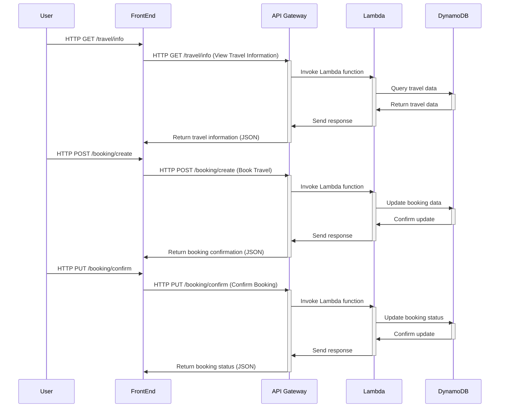

```mermaid
sequenceDiagram
    participant User
    participant FrontEnd
    participant API Gateway
    participant Lambda
    participant DynamoDB

    User->>FrontEnd: HTTP GET /travel/info
    FrontEnd->>API Gateway: HTTP GET /travel/info (View Travel Information)
    activate API Gateway
    API Gateway->>Lambda: Invoke Lambda function
    activate Lambda
    Lambda->>DynamoDB: Query travel data
    activate DynamoDB
    DynamoDB->>Lambda: Return travel data
    deactivate DynamoDB
    Lambda->>API Gateway: Send response
    deactivate Lambda
    API Gateway->>FrontEnd: Return travel information (JSON)
    deactivate API Gateway

    User->>FrontEnd: HTTP POST /booking/create
    FrontEnd->>API Gateway: HTTP POST /booking/create (Book Travel)
    activate API Gateway
    API Gateway->>Lambda: Invoke Lambda function
    activate Lambda
    Lambda->>DynamoDB: Update booking data
    activate DynamoDB
    DynamoDB->>Lambda: Confirm update
    deactivate DynamoDB
    Lambda->>API Gateway: Send response
    deactivate Lambda
    API Gateway->>FrontEnd: Return booking confirmation (JSON)
    deactivate API Gateway

    User->>FrontEnd: HTTP PUT /booking/confirm
    FrontEnd->>API Gateway: HTTP PUT /booking/confirm (Confirm Booking)
    activate API Gateway
    API Gateway->>Lambda: Invoke Lambda function
    activate Lambda
    Lambda->>DynamoDB: Update booking status
    activate DynamoDB
    DynamoDB->>Lambda: Confirm update
    deactivate DynamoDB
    Lambda->>API Gateway: Send response
    deactivate Lambda
    API Gateway->>FrontEnd: Return booking status (JSON)
    deactivate API Gateway
        
```